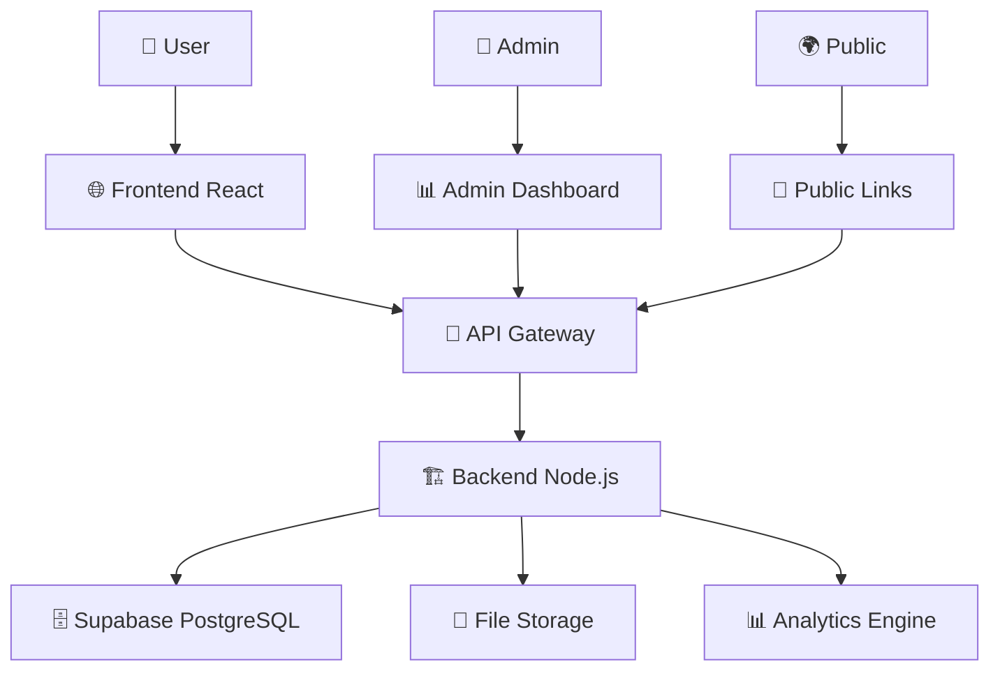

# 🌟 LumiLink - Bio-Link Platform

<div align="center">


**🚀 Nền tảng bio-link mạnh mẽ và linh hoạt**


[](https://nodejs.org/)
[](https://reactjs.org/)
[](https://docker.com/)
[](https://supabase.com/)

[🎯 Demo Live](https://demo.lumilink.site) • [📚 Tài liệu API](backend/API_DOCUMENTATION.md) • [🐛 Báo lỗi](https://github.com/Shiin2ii/lumilink/issues) • [💬 Discord](https://discord.gg/lumilink)

</div>

---

## ✨ Tính năng nổi bật

<table>
<tr>
<td width="50%">

### 🎨 **Giao diện đẹp mắt**
- 📱 Responsive hoàn hảo
- 🎭 Animations mượt mà
- 🖼️ Upload ảnh/video background

</td>
<td width="50%">

### 📊 **Analytics mạnh mẽ**  
- 📈 Thống kê chi tiết từng link
- 🌍 Phân tích theo quốc gia
- 📱 Device & browser tracking
- 📅 Báo cáo theo thời gian

</td>
</tr>
<tr>
<td>

### 🏆 **Hệ thống Badge**
- 🎯 25+ achievements
- 🏅 Leaderboard cộng đồng  
- 🎮 Gamification experience
- ⭐ Unlock premium features

</td>
<td>

### 👑 **Premium Features**
- 🎨 Unlimited customization
- 📊 Advanced analytics
- 🌐 Custom domain
- 📧 Email integration

</td>
</tr>
</table>

---

## 🚀 Quick Start - Chạy chương trình 

### 🐳 **Cách 1: Docker (Khuyến nghị)**

```bash
# 📥 Clone repository
git clone https://github.com/Shiin2ii/lumilink.git
cd lumilink

# 🚀 Khởi động  hệ thống
docker-compose up -d

# 🎉 Truy cập ứng dụng
# Frontend: http://localhost:3000
# Backend API: http://localhost:3001
# API Docs: http://localhost:3001/api-docs
```

### ⚡ **Cách 2: Development Mode**

<details>
<summary><b>🔧 Setup Backend</b></summary>

```bash
# 📂 Vào thư mục backend
cd backend

# 📋 Tạo file environment
cp env.example .env

# 📦 Cài đặt dependencies
npm install

# 🚀 Khởi động development server
npm run dev
# hoặc sử dụng Docker


docker-compose up backend-dev
```


</details>

<details>
<summary><b>🎨 Setup Frontend</b></summary>

```bash
# 📂 Vào thư mục frontend  
cd frontend

# 📦 Cài đặt dependencies
npm install

# 🚀 Khởi động React app
npm start
# hoặc sử dụng Docker
docker-compose up app-dev

```


</details>

---

## 🧪 Testing & Demo

### 🎮 **Tài khoản Demo có sẵn**

<table>
<tr>
<th>👤 Role</th>
<th>📧 Email</th>
<th>🔑 Password</th>
<th>🎯 Mục đích</th>
</tr>
<tr>
<td>👑 <b>Admin</b></td>
<td><code>admin@lumilink.site</code></td>
<td><code>admin1234</code></td>
<td>Quản lý hệ thống, xem analytics tổng</td>
</tr>
<tr>
<td>🆓 <b>Free User</b></td>
<td><code>userfree@lumilink.site</code></td>
<td><code>User@123</code></td>
<td>Trải nghiệm tính năng cơ bản</td>
</tr>
<tr>
<td>💎 <b>Premium</b></td>
<td><code>userpremium@lumilink.site</code></td>
<td><code>User@123</code></td>
<td>Tất cả tính năng premium</td>
</tr>
</table>

### 🧪 **Chạy Test Suite**

```bash
# 🔍 Test toàn bộ API endpoints
cd backend
docker-compose run --rm backend-dev node test-api.js

# 📊 Kết quả mẫu:
# ✅ Authentication: 8/8 passed
# ✅ Profiles: 6/6 passed  
# ✅ Links: 10/10 passed
# ✅ Analytics: 5/5 passed
# 🎉 Total: 29/29 tests passed!
```

---

## 🏗️ Kiến trúc hệ thống

<div align="center">



</div>

### 🛠️ **Tech Stack**

<table>
<tr>
<td><b>Frontend</b></td>
<td>
  
  
  
</td>
</tr>
<tr>
<td><b>Backend</b></td>
<td>
  
  
  
</td>
</tr>
<tr>
<td><b>Database</b></td>
<td>
  
  
</td>
</tr>
<tr>
<td><b>DevOps</b></td>
<td>
  
  
</td>
</tr>
</table>

---

## 📁 Cấu trúc dự án

```
🌟 LumiLink/
├── 🗂️ backend/                 # Node.js API Server
│   ├── 📝 API_DOCUMENTATION.md  # 📚 Tài liệu API chi tiết  
│   ├── 🐳 docker-compose.yml    # Docker configuration
│   ├── 🔧 src/
│   │   ├── 🎮 controllers/      # Business logic
│   │   ├── 🛣️ routes/          # API endpoints
│   │   ├── 🗃️ models/          # Database models
│   │   ├── 🛡️ middleware/       # Auth, validation, etc.
│   │   └── ⚙️ config/          # App configuration
│   ├── 🧪 test-api.js          # Comprehensive API tests
│   └── 📁 uploads/             # User uploaded files
│
├── 🎨 frontend/                # React Web App
│   ├── 🐳 docker-compose.yml   # Frontend Docker setup
│   ├── 📱 src/
│   │   ├── 🧩 components/       # Reusable UI components
│   │   ├── 📄 pages/           # App pages/screens
│   │   ├── 🔄 services/        # API integration
│   │   ├── 🎯 contexts/        # React contexts
│   │   └── 🎨 styles/          # CSS & Tailwind
│   └── 🌍 public/              # Static assets
│       └── 🎭 decorations/     # 400+ badge icons
│
└── 📖 README.md               # 👋 Bạn đang đọc đây!
```

---

## 🎯 Hướng dẫn sử dụng nhanh

### 1️⃣ **Tạo Profile đầu tiên**
```bash
# 🚀 Khởi động app
docker-compose up -d

# 🌐 Mở browser
open http://localhost:3000

# ✨ Đăng ký tài khoản mới hoặc dùng demo account
```

### 2️⃣ **Tùy chỉnh giao diện**
- 🎨 Chọn theme yêu thích
- 🖼️ Upload avatar & background
- ✏️ Viết bio hấp dẫn
- 🎭 Chọn font & màu sắc

### 3️⃣ **Thêm links**
- ➕ Thêm link Instagram, TikTok, Website...
- 🎨 Tùy chỉnh style từng button
- 📊 Theo dõi số click realtime
- 🔄 Drag & drop để sắp xếp

### 4️⃣ **Chia sẻ profile**
```
🔗 Link của bạn: lumilink.site/username
📱 QR Code tự động
📊 Xem analytics chi tiết
```

---

## 🤝 Contributing

Chúng tôi rất hoan nghênh mọi đóng góp! 

### 🎯 **Cách đóng góp:**

1. 🍴 **Fork** repository này
2. 🌿 Tạo **feature branch**: `git checkout -b feature/AmazingFeature`
3. 💾 **Commit** changes: `git commit -m 'Add some AmazingFeature'`
4. 📤 **Push** to branch: `git push origin feature/AmazingFeature`
5. 🔄 Tạo **Pull Request**

### 🐛 **Báo lỗi:**
- 🎯 Sử dụng [GitHub Issues](https://github.com/Shiin2ii/lumilink/issues)
- 📝 Mô tả chi tiết lỗi và cách reproduce
- 📸 Attach screenshots nếu có

### 💡 **Đề xuất tính năng:**
- 🌟 Tạo [Feature Request](https://github.com/Shiin2ii/lumilink/issues/new?template=feature_request.md)
- 💭 Giải thích use case và lợi ích
- 🎨 Mockup/wireframe nếu có

---

## 📞 Liên hệ & Hỗ trợ

<div align="center">

### 🌟 **Kết nối với chúng tôi**

[](https://discord.gg/lumilink)
[](mailto:support@lumilink.site)
[](https://lumilink.site)

</div>

### 📚 **Tài liệu & Resources**

- 📖 [**API Documentation**](backend/API_DOCUMENTATION.md) - Chi tiết 50+ endpoints
- 🎥 [**Video Tutorials**](https://youtube.com/lumilink) - Hướng dẫn từng bước  
- 📊 [**System Status**](https://status.lumilink.site) - Uptime & performance
- 💬 [**Community Forum**](https://community.lumilink.site) - Q&A và thảo luận

### 🆘 **Hỗ trợ nhanh**

- 🐛 **Bug Reports**: [GitHub Issues](https://github.com/Shiin2ii/lumilink/issues)
- 💡 **Feature Requests**: [Feature Board](https://features.lumilink.site)  
- 📧 **Email Support**: support@lumilink.site
- 💬 **Live Chat**: Available on website

---

## 📄 License

Dự án này được phát hành dưới giấy phép **MIT License**.

```
MIT License

Copyright (c) 2025 LumiLink Team

Permission is hereby granted, free of charge, to any person obtaining a copy
of this software and associated documentation files (the "Software"), to deal
in the Software without restriction, including without limitation the rights
to use, copy, modify, merge, publish, distribute, sublicense, and/or sell
copies of the Software...
```

📖 [Đọc full license](LICENSE)

---

<div align="center">


### 💝 **Cảm ơn bạn đã quan tâm đến LumiLink!**

**Nếu project này hữu ích, đừng quên ⭐ star repo để ủng hộ team nhé!**

**Made with ❤️ by LumiLink Team **

</div>
